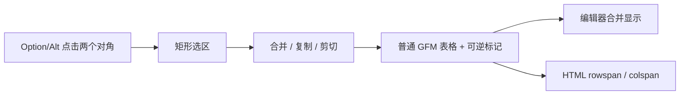

<div align="center">

# Typora Table Merge

**让 Typora 原生 Markdown 表格拥有可编辑、可撤销、可保存、可导出的合并单元格。**

[](https://github.com/TONYHUaNGggggg/typora-plugin-table-merge/actions/workflows/ci.yml)
[](https://github.com/TONYHUaNGggggg/typora-plugin-table-merge/releases/latest)
[](LICENSE.md)
[](#兼容性)

[English](README.md) · [快速开始](#快速开始) · [操作说明](#操作说明) · [原生菜单](#macos-原生系统菜单) · [常见问题](#常见问题)

</div>

---

Typora Table Merge 不会把表格转换成难以继续编辑的 HTML Block。文件仍然保存为普通 GFM Markdown 表格，编辑器中显示真正的合并效果，HTML 导出时生成标准 `rowspan` / `colspan`。

## 功能一览

| 能力 | 行为 |
| --- | --- |
| 矩形选择 | 按住 Option/Alt 点击两个对角；支持 1×N、N×1 和任意矩形 |
| 键盘调整 | Option/Alt + 方向键扩展或收缩选区，Esc 取消 |
| 合并与取消 | 保留所有被覆盖单元格的原始内容，取消合并时无损恢复 |
| 表格结构编辑 | 插入/删除行列时自动扩展、收缩或平移合并区域 |
| 区域剪贴板 | 复制、剪切、粘贴完整矩形，并保留其中的合并结构 |
| 编辑器显示 | 合并单元格悬停边界、尺寸标签和统一的选区样式 |
| 导出 | HTML 输出真正的 `rowspan` / `colspan`，不包含内部标记 |
| 原生撤销 | 所有内容修改进入 Typora 自带的撤销/重做历史 |
| 系统右键菜单 | macOS 实验性原生桥接把命令加入 Typora 自带“表格”子菜单 |



## 快速开始

### 1. 安装社区插件核心

先按 [`typora-community-plugin`](https://github.com/typora-community-plugin/typora-community-plugin) 的说明安装插件核心。macOS 安装核心会修改 `Typora.app` 并使厂商签名失效，操作前请保留一份可恢复副本。

### 2. 安装 Table Merge

从 [Releases](https://github.com/TONYHUaNGggggg/typora-plugin-table-merge/releases/latest) 下载 `plugin.zip`，解压到社区插件核心的全局插件目录。插件目录中应当直接包含：

```text
tonyhuang.table-merge/
├── manifest.json
├── main.js
└── style.css
```

已验证的 macOS 目录为：

```text
~/Library/Application Support/abnerworks.Typora/plugins/plugins/tonyhuang.table-merge/
```

然后打开 **插件设置 → 已安装插件**，启用 **Table Merge**，并完整退出后重新打开 Typora。覆盖插件文件后也必须重启，因为 Typora 会在应用生命周期内缓存已加载的 JavaScript 模块。

## 操作说明

### 选择与合并

1. 按住 Option（Windows/Linux 为 Alt）点击矩形的第一个角。
2. 继续按住 Option/Alt，点击相对的另一个角。
3. 右键蓝色选区，在 **表格** 子菜单中选择 **合并所选单元格**。
4. 右键已经合并的单元格，选择 **取消合并单元格**。

设置起点以后，也可以按住 Option/Alt 并使用方向键移动另一个角；向外扩展、向起点方向返回则收缩。按 Esc 清除选区。

普通点击、文本选择和鼠标拖动仍完全交给 Typora。正常选择和操作成功时插件保持静默，只有非法选择、无法执行或发生错误时才显示通知。

### 复制、剪切与粘贴

- 复制或剪切前，必须完整包含选区所接触的每一个合并单元格；插件会拒绝切开合并区域。
- 粘贴到同尺寸矩形时会逐格覆盖。
- 只选择一个目标单元格时，它会作为粘贴区域的左上角。
- 区域内部的横向和纵向合并关系会一并复制。

### 插入与删除行列

当操作穿过合并区域时，插件会维护结构：

| 操作位置 | 结果 |
| --- | --- |
| 合并区域外部 | 合并区域整体平移或保持不变 |
| 合并区域内部插入 | 对应合并区域自动扩展 |
| 合并区域内部删除 | 对应合并区域自动收缩 |
| 删除合并区域左上角所在行/列 | 自动提升仍存在的单元格并保留内容 |

### 快速合并

把光标放在普通单元格中，可通过命令面板执行：

- **表格：当前单元格与下方单元格合并**
- **表格：当前单元格与右侧单元格合并**

## macOS 原生系统菜单

网页插件只能绘制网页菜单，无法直接修改 macOS 的 `NSMenu`。本仓库额外提供一个实验性原生桥接，将这些操作加入 Typora 自带的 **表格** 子菜单：

- 合并所选单元格 / 取消合并单元格（根据当前状态只显示一项）
- 复制所选区域 / 剪切所选区域 / 粘贴表格区域
- 对含合并结构的表格安全地插入、删除行列

> [!WARNING]
> 原生桥接会修改 `Typora.app`，使用 Typora 私有实现，并对应用重新进行临时签名。它不是 Typora 官方扩展接口，目前仅验证 macOS Typora 1.14.9（build 7785）。请先完整备份应用；Typora 更新后通常需要重新安装桥接。

### 从 Release 安装

1. 下载 `typora-table-merge-macos-native-<版本>.zip` 并解压。
2. 确保网页插件已经安装并启用。
3. 完全退出 Typora，然后在解压目录执行：

```bash
ditto "/Applications/Typora.app" "$HOME/Desktop/Typora-before-table-merge.app"
./native/macos/install-permanent.sh "/Applications/Typora.app"
```

重新打开 Typora。移除桥接并恢复安装前的主程序：

```bash
./native/macos/uninstall-permanent.sh "/Applications/Typora.app"
```

源代码构建、隔离测试和实现细节见 [macOS 原生桥接说明](native/macos/README.zh-CN.md)。

## 数据与导出

插件使用普通 GFM 表格作为唯一数据源。被覆盖的单元格保存为 `::tmc-up:...::` 或 `::tmc-left:...::` 标记，载荷使用十六进制编码保存原始单元格源码。这样能够：

- 取消合并时无损恢复内容；
- 与 Typora 原生撤销/重做兼容；
- 保存后重新打开仍能重建合并结构；
- HTML 导出时删除覆盖单元格并输出标准合并属性。

内部标记在正常编辑、选择和导出结果中都会被隐藏。

## 兼容性

| 环境 | 网页插件 | 原生系统菜单 |
| --- | --- | --- |
| macOS + Typora 1.14.9 build 7785 | 已验证 | 已验证 |
| Windows | 尚未实机验证 | 不支持，需单独开发原生桥接 |
| Linux | 尚未实机验证 | 不支持 |

验证范围包括首屏渲染、保存后重载、原生撤销/重做、结构编辑、区域剪贴板和 HTML 导出。PDF、Word、Epub 尚未逐项验证。

## 常见问题

### 选区出现了，但原生“表格”菜单里没有合并命令

网页插件已经工作，但 macOS 原生桥接没有加载。安装 Release 中的 native 包，完全退出 Typora 后重新打开。只安装 `plugin.zip` 时仍可使用插件的网页菜单回退方案。

### Markdown 中看到了 `::tmc-...::`

插件没有加载、没有启用，或者 Typora 尚未重启。不要手动编辑标记，先检查插件设置并重启应用。

### macOS 提示“Typora.app 已损坏”

这通常是修改应用包后签名或隔离属性不匹配导致的，不代表文档损坏。优先恢复备份，再按社区核心说明重新安装。原生桥接安装脚本会在完成后重新签名并验证应用。

### Typora 更新以后命令消失

更新可能覆盖社区插件核心和原生桥接。先确认社区核心与 Table Merge 是否仍启用，再重新安装与新版本兼容的原生桥接。不要在未经验证的 Typora 版本上直接覆盖正式应用。

## 当前边界

- 只映射顶层 GFM 表格；引用块、列表中的嵌套表格暂不支持。
- 纵向合并不能跨越表头与正文分界线。
- HTML 导出已验证，其他导出格式可能取决于 Typora 自身的导出管线。
- 普通表格不经过合并 DOM 后处理，以避免干扰 Typora 原生插入表格流程。
- 原生菜单桥接依赖 Typora 私有 Objective-C 类，升级后可能需要适配。

## 开发与验证

需要 Node.js 22、pnpm 11。macOS 原生桥接还需要 Xcode Command Line Tools。

```bash
pnpm install --frozen-lockfile
pnpm test
pnpm run typecheck
pnpm run build
pnpm run pack
```

构建原生桥接与发布包：

```bash
./native/macos/build.sh
./native/macos/build-launcher.sh
./native/macos/pack.sh 0.3.0
```

架构与数据不变量见 [docs/ARCHITECTURE.md](docs/ARCHITECTURE.md)，参与开发请阅读 [CONTRIBUTING.md](CONTRIBUTING.md)。版本变化见 [CHANGELOG.md](CHANGELOG.md)。

## 许可证

[MIT](LICENSE.md) © Tony Huang
