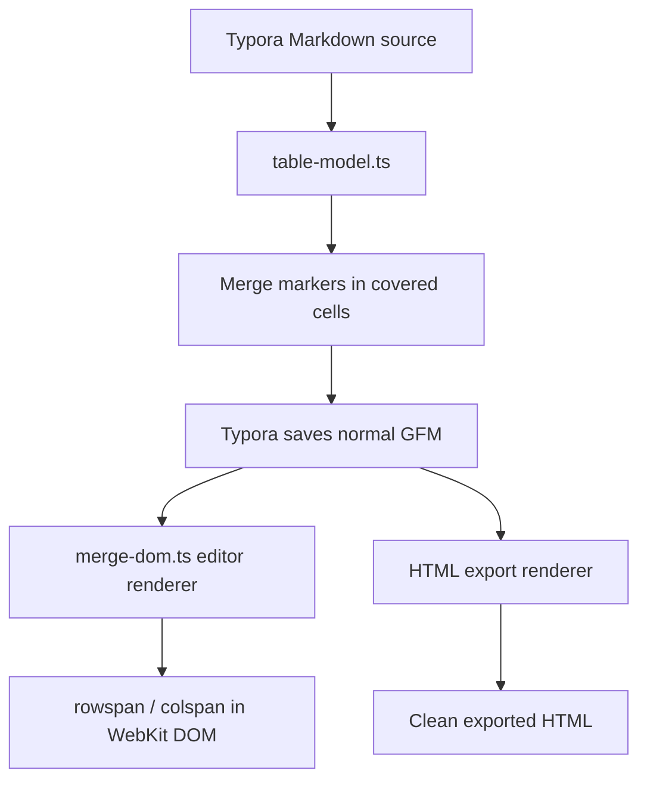

# Architecture

Typora Table Merge keeps the Markdown table as the source of truth. It does not maintain a second document model and does not replace a table with an HTML block.

## Data flow

`src/table-model.ts` parses top-level GFM tables and owns all source transformations. `src/merge-dom.ts` converts valid marker groups into a visual table for the editor or export. `src/main.ts` coordinates Typora selection, commands, undo-aware content reloads, context menus, and the optional native bridge.

## Marker model

A merge group has one visible origin cell at its top-left corner. Every covered cell stores both a direction and its previous source:

- `::tmc-left:<hex>::` points to the cell on its left.
- `::tmc-up:<hex>::` points to the cell above it.
- `<hex>` is UTF-8 source content encoded as hexadecimal.

The direction graph must resolve to one origin and must form a complete rectangle. The renderer refuses malformed structures instead of guessing. Unmerge decodes the payload in every covered cell, so content restoration is lossless.

Legacy `<` / `^` markers remain readable for migration, but new writes use the explicit `::tmc-...::` form.

## Structural invariants

All source mutations preserve these rules:

1. A merge is a continuous rectangle.
2. Its origin is the top-left cell.
3. A vertical merge never crosses the GFM header delimiter.
4. Clipboard extraction cannot contain only part of a merge.
5. Row and column operations transform the merge rectangle before serializing markers.
6. Successful changes go through Typora's content reload API so native undo and redo remain available.

## Native macOS bridge

The optional bridge hooks Typora's private `ContextMenuCommands` Objective-C class at runtime. It inspects state published by the web plugin, inserts context-sensitive items into the existing Table submenu, and dispatches chosen commands back into the WebKit document.

The permanent launcher preserves the original Typora executable as `Typora.table-merge-original`, loads `TMNativeMenuBridge.dylib`, and then starts that original executable. The install and uninstall scripts ad-hoc sign and verify the complete app bundle after changing it.

This boundary is deliberately optional: all Markdown transformation and rendering behavior remains in the web plugin, while the native component only integrates with the macOS menu.
